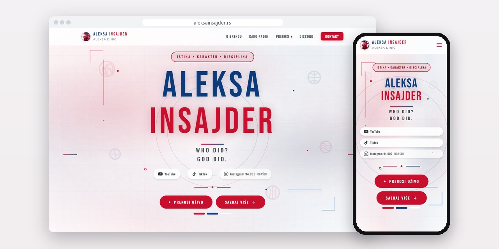
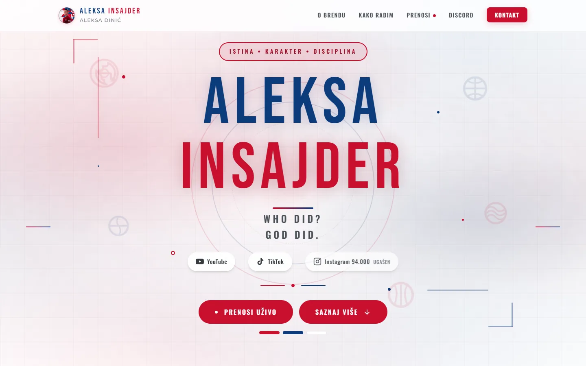
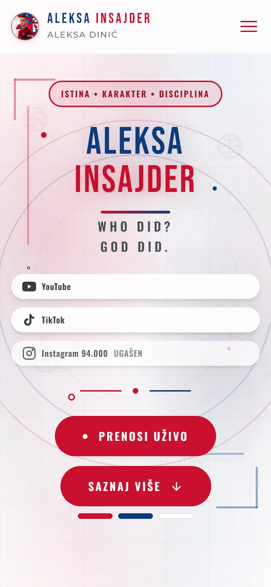
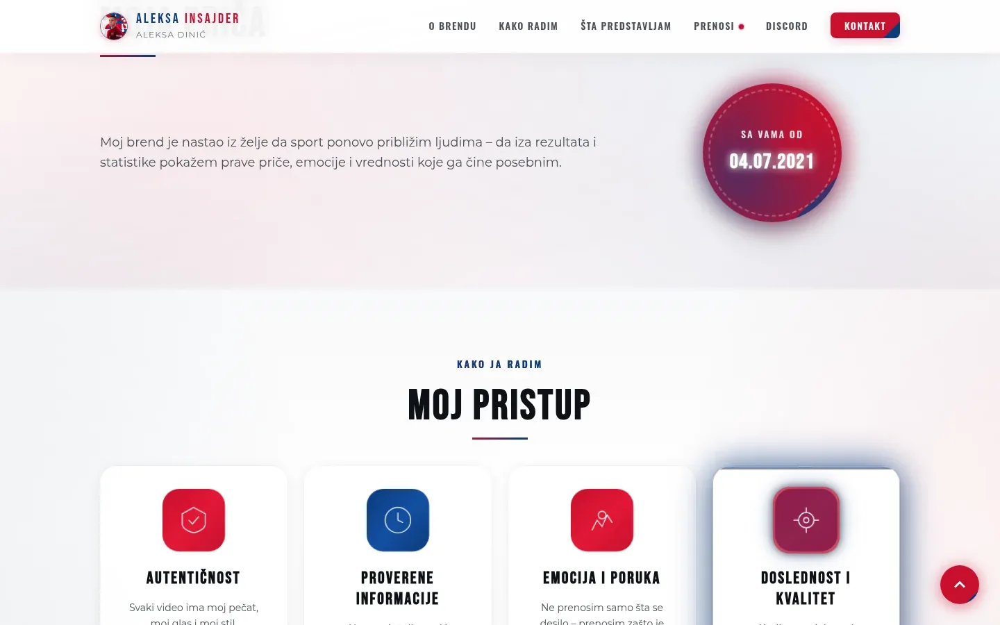
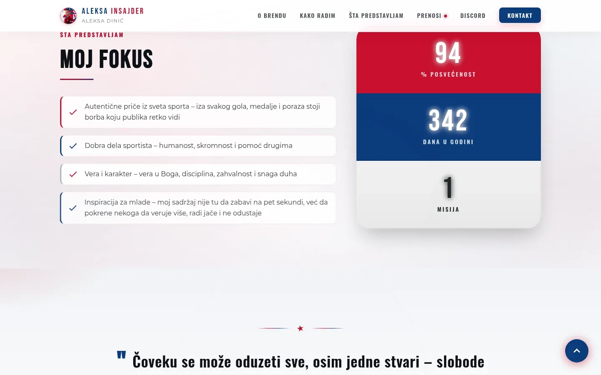

# Aleksa Insajder

Brend sajt sportskog kreatora, sa stranom prenosa koju puni sa telefona i sopstvenom statistikom poseta bez kolačića.

**[aleksainsajder.rs](https://aleksainsajder.rs/)** · [Studija slučaja](https://svilenkovic.rs/radovi/aleksa-insajder) · [English](README.md)

> [!NOTE]
> Klijentski projekat. Izvorni kod pripada klijentu i čuva se u privatnom repozitorijumu. Ova stranica opisuje šta sam uradio i kako.

<table>
  <tr><td><b>Klijent</b></td><td>Aleksa Insajder</td></tr>
  <tr><td><b>Delatnost</b></td><td>Sportski video sadržaj</td></tr>
  <tr><td><b>Lokacija</b></td><td>Srbija</td></tr>
  <tr><td><b>Vrsta</b></td><td>Brend sajt na jednoj strani sa stranom prenosa (PWA)</td></tr>
  <tr><td><b>Moj deo posla</b></td><td>Dizajn, izrada, SEO, hosting i održavanje</td></tr>
  <tr><td><b>Tehnologije</b></td><td>PHP 8.3, SQLite, PWA, nginx</td></tr>
</table>

## O projektu

Aleksa Insajder je sportski kreator koji na TikToku i YouTube-u pravi priče o sportistima, a oko brenda postoji i Discord zajednica. Trebale su mu dve strane: jedna koja brend objasni u jednom skrolu, za ljude koji stižu preko linka sa profila, i druga koju sam puni sa telefona dok meč traje. Sve što objavljuje moralo je da se menja iz panela, bez diranja koda.

Strana prenosa prikazuje događaje koje on izdvoji, najviše deset kartica, u rasporedu koji se prilagođava njihovom broju. Dok posetilac ne klikne, u kartici stoji samo poster sa samog sajta, a provera mreže je potvrdila da pre klika ništa ne ide ka trećim stranama. Server pamti samo link, naslov i vreme dodavanja. Sam video ne preuzima, ne čuva i ne emituje dalje: to sam odlučio na početku, da server ne bi postao distributer tuđeg materijala.

## Šta sam uradio

- Panel instaliran kao aplikacija na početnom ekranu telefona, sa ograničenjem pokušaja prijave koje sada drži i pod paralelnim zahtevima
- Statistika bez kolačića u SQLite bazi: posetilac se prepoznaje po otisku sa mesečnom solju, prijemnik prihvata samo poznate putanje, a vreme gledanja se meri po prenosu
- Ispravka u service workeru: keširani CSS nikad nije odgovarao adresi sa verzijom, pa je jedan kiks mobilne mreže mogao da ostavi stranu bez stilova
- Sesije premeštene iz zajedničkog foldera koji je sistem čistio na pola sata, zbog čega ga je panel izbacivao usred meča
- Starost kartice vidljiva u panelu, sa žutom oznakom posle dvanaest sati, da se stari mečevi provere
- Politika privatnosti i uslovi korišćenja pisani za ovaj sajt, sa opisom statistike i napomenom o ugrađenim prenosima

## Merenja

| | Performanse | Pristupačnost | Dobre prakse | SEO |
| :-- | :-: | :-: | :-: | :-: |
| Telefon | 93 | 100 | 100 | 100 |
| Desktop | 100 | 100 | 100 | 100 |

PageSpeed Insights, laboratorijsko merenje živog sajta, septembar 2026. Sigurnosna zaglavlja: 6 od 6. HTML validator: bez grešaka. axe provera pristupačnosti: bez prekršaja. Strukturisani podaci: `Organization`, `Person`.

## Snimci ekrana

<table>
  <tr>
    <td width="68%" valign="top"></td>
    <td width="32%" valign="top"></td>
  </tr>
</table>

Moja priča, pa četiri načela: autentičnost, provere, emocija i doslednost

Moj fokus, pa citat Viktora Frankla kao predah pred kontakt

---

Izrada: [D. Svilenković](https://svilenkovic.rs).
